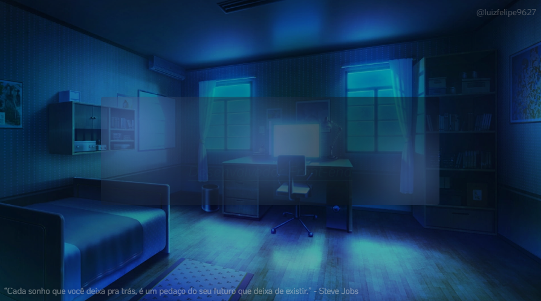

## Seja bem vindo(a) ao meu perfil. 

  

##

### :trophy: &nbsp;Meu status

    
  

##

### :curly_haired_man: &nbsp;Sobre mim

<ul>
  <li>:man_student: &nbsp Cursando Análise e Desenvolvimento de Sistemas;</li>
  <li>:books: &nbsp; Estudando Desenvolvimento Front-end com React e TypeScript;</li>
  <li>:dart: &nbsp; Foco em TypeScript;</li>
  <li>:computer: &nbsp; Programar todos os dias é necessário;</li>
  <li>:heart: &nbsp; Amor por codar.</li>
</ul>

 

##

### :rocket: &nbsp;**Minhas habilidades**

<table align="left" height="255px">
  <tr>
    <td align="center">
       
      
        <b>
          <pre>HTML5</pre>
        </b>
      
    </td>
    <td align="center">
       
      
        <b>
          <pre>CSS3</pre>
        </b>
      
    </td>
     <td align="center">
       
      
        <b>
          <pre>JavaScript</pre>
        </b>
      
    </td>
    <td align="center">
       
      
        <b>
          <pre>React.JS</pre>
        </b>
      
    </td>
    <td align="center">
       
      
        <b>
          <pre>SASS</pre>
        </b>
      
    </td>
  </tr>
  
  <tr>
    <td align="center">
       
      
        <b>
          <pre>Gulp</pre>
        </b>
      
    </td>
    <td align="center">
       
      
        <b>
          <pre>Git</pre>
        </b>
      
    </td>
    <td align="center">
       
      
        <b>
          <pre>GitHub</pre>
        </b>
      
    </td>
    <td align="center">
       
      
        <b>
          <pre>Styled   Components</pre>
        </b>
      
    </td>
    <td align="center">
       
      
        <b>
          <pre>TypeScript</pre>
        </b>
      
    </td>
  </tr>

  <tr>
   <td align="center">
     
    
      <b>
        <pre>Figma</pre>
      </b>
    
   </td>
  </tr>
</table>

            

##

### :book: &nbsp;**Pretendo aprender**

<table align="right">
  <tr>
    <td align="center">
       
      
        <b>
          <pre>Tailwind</pre>
        </b>
      
    </td>
    <td align="center">
       
      
        <b>
          <pre>Node.JS</pre>
        </b>
      
    </td>
    <td align="center">
       
      
        <b>
          <pre>Bootstrap 5</pre>
        </b>
      
    </td>
    <td align="center">
       
      
        <b>
          <pre>Wordpress</pre>
        </b>
      
    </td>
    <td align="center">
       
      
        <b>
          <pre>Python</pre>
        </b>
      
    </td>
  </tr>

  <tr>
    <td align="center">
       
      
        <b>
          <pre>MySQL</pre>
        </b>
      
    </td>
  </tr>
</table>

             

##

### :earth_americas: &nbsp;Onde me encontrar

  <a href="https://api.whatsapp.com/send?phone=5511952353969" target="_blank">
    
    &nbsp;
  </a>

  <a href="https://linkedin.com/in/luizfelipe9627" target="_blank">
    
    &nbsp;
  </a>

  <a href="https://www.behance.net/luizfelipe9627" target="_blank">
    
    &nbsp;
  </a>

  <a href="mailto:felipesilva9627@hotmail.com" target="_blank">
    
    &nbsp;
  </a>

##

